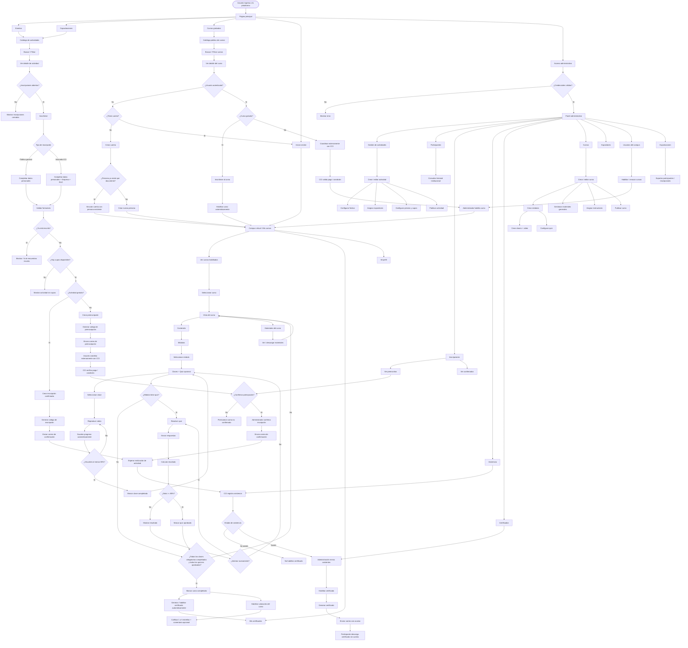

# Documentación

## Criterios arquitectónicos vigentes

Cuando exista una diferencia entre documentos, se aplicará el siguiente orden de precedencia:

1. la especificación detallada del hito que se está implementando define su alcance;
2. el diccionario de datos en su versión corregida define el esquema físico;
3. el documento de diseño técnico define la arquitectura transversal;
4. este documento conserva los diagramas y la visión global.

Además, quedan fijadas las siguientes decisiones:

- todas las tablas expuestas mediante la Data API tendrán RLS habilitado desde la migración que las crea;
- las políticas se incorporarán incrementalmente con cada hito y el Hito 11 realizará la auditoría y el endurecimiento final;
- la identidad `document_type + document_number` de `people` es única de forma permanente, incluso después de un soft delete;
- una persona eliminada lógicamente deberá restaurarse o reutilizarse, nunca duplicarse;
- la autenticación administrativa mínima se implementará antes de habilitar mutaciones del panel administrativo;
- el registro y acceso completo de estudiantes al Campus se completará en el Hito 6;
- los materiales pertenecen al curso y no a módulos o clases;
- en Next.js 16 se utilizará `src/proxy.ts`, no `middleware.ts`;
- las carpetas se crearán conforme tengan uso real, evitando estructuras vacías anticipadas.

Diagrama Entidad-Relacion

```mermaid
erDiagram

    AUTH_USERS {
        uuid id PK
        text email
    }

    PEOPLE {
        uuid id PK
        text document_type
        text document_number
        text first_names
        text last_names
        text email
        text phone
        text job_title
        text company
        text ruc
        text address
        timestamptz created_at
        timestamptz updated_at
        timestamptz deleted_at
        uuid deleted_by FK
    }

    USER_ACCOUNTS {
        uuid user_id PK, FK
        uuid person_id FK
        text role
        boolean is_active
        timestamptz created_at
        timestamptz updated_at
        timestamptz deleted_at
        uuid deleted_by FK
    }

    CATEGORIES {
        uuid id PK
        text name
        text slug
        text description
        int sort_order
        boolean is_active
        timestamptz created_at
        timestamptz updated_at
        timestamptz deleted_at
        uuid deleted_by FK
    }

    SPEAKERS {
        uuid id PK
        text first_names
        text last_names
        text professional_title
        text organization
        text bio
        text photo_path
        timestamptz created_at
        timestamptz updated_at
        timestamptz deleted_at
        uuid deleted_by FK
    }

    ACTIVITIES {
        uuid id PK
        uuid category_id FK
        text type
        text title
        text slug
        text short_description
        text description
        text objective
        text target_audience
        text modality
        text location_name
        text address
        text virtual_url
        text duration_text
        numeric academic_hours
        text program
        text syllabus
        text banner_path
        boolean is_free
        numeric general_price
        numeric member_price
        boolean members_only
        int capacity
        timestamptz registration_open_at
        timestamptz registration_close_at
        boolean registrations_closed_manually
        text contact_name
        text contact_phone
        text contact_email
        text additional_info
        text status
        timestamptz published_at
        uuid created_by FK
        uuid updated_by FK
        timestamptz created_at
        timestamptz updated_at
        timestamptz deleted_at
        uuid deleted_by FK
    }

    ACTIVITY_DATES {
        uuid id PK
        uuid activity_id FK
        timestamptz starts_at
        timestamptz ends_at
        text label
        int sort_order
        timestamptz created_at
        timestamptz updated_at
        timestamptz deleted_at
        uuid deleted_by FK
    }

    ACTIVITY_SPEAKERS {
        uuid id PK
        uuid activity_id FK
        uuid speaker_id FK
        text role_label
        int sort_order
        timestamptz created_at
        timestamptz updated_at
        timestamptz deleted_at
        uuid deleted_by FK
    }

    REGISTRATIONS {
        uuid id PK
        uuid activity_id FK
        uuid person_id FK
        text registration_code
        text registration_type
        text status
        text company_snapshot
        text ruc_snapshot
        numeric price_snapshot
        timestamptz confirmed_at
        uuid confirmed_by FK
        timestamptz cancelled_at
        uuid cancelled_by FK
        text cancellation_reason
        timestamptz created_at
        timestamptz updated_at
        timestamptz deleted_at
        uuid deleted_by FK
    }

    ATTENDANCE {
        uuid id PK
        uuid registration_id FK
        text status
        timestamptz marked_at
        uuid marked_by FK
        text notes
        timestamptz created_at
        timestamptz updated_at
        timestamptz deleted_at
        uuid deleted_by FK
    }

    COURSES {
        uuid id PK
        text title
        text slug
        text short_description
        text description
        text objectives
        text contents_overview
        text duration_text
        numeric academic_hours
        text banner_path
        boolean is_free
        numeric general_price
        numeric member_price
        text status
        timestamptz published_at
        uuid created_by FK
        uuid updated_by FK
        timestamptz created_at
        timestamptz updated_at
        timestamptz deleted_at
        uuid deleted_by FK
    }

    COURSE_INSTRUCTORS {
        uuid id PK
        uuid course_id FK
        uuid speaker_id FK
        boolean is_primary
        text role_label
        int sort_order
        timestamptz created_at
        timestamptz updated_at
        timestamptz deleted_at
        uuid deleted_by FK
    }

    COURSE_MODULES {
        uuid id PK
        uuid course_id FK
        text title
        text description
        int sort_order
        boolean is_published
        timestamptz created_at
        timestamptz updated_at
        timestamptz deleted_at
        uuid deleted_by FK
    }

    LESSONS {
        uuid id PK
        uuid module_id FK
        text title
        text description
        int sort_order
        text video_provider
        text video_asset_id
        text video_storage_path
        int duration_seconds
        boolean is_required
        boolean is_published
        timestamptz created_at
        timestamptz updated_at
        timestamptz deleted_at
        uuid deleted_by FK
    }

    COURSE_MATERIALS {
        uuid id PK
        uuid course_id FK
        text title
        text description
        text material_type
        text storage_path
        text external_url
        text mime_type
        bigint file_size_bytes
        int sort_order
        timestamptz created_at
        timestamptz updated_at
        timestamptz deleted_at
        uuid deleted_by FK
    }

    COURSE_ENROLLMENTS {
        uuid id PK
        uuid course_id FK
        uuid person_id FK
        text status
        text registration_type
        numeric price_snapshot
        numeric progress_percent
        timestamptz access_granted_at
        uuid access_granted_by FK
        timestamptz completed_at
        timestamptz revoked_at
        uuid revoked_by FK
        text revocation_reason
        timestamptz created_at
        timestamptz updated_at
        timestamptz deleted_at
        uuid deleted_by FK
    }

    LESSON_PROGRESS {
        uuid id PK
        uuid enrollment_id FK
        uuid lesson_id FK
        int watched_seconds
        int last_position_seconds
        int duration_seconds_snapshot
        numeric completion_percent
        boolean is_completed
        timestamptz completed_at
        timestamptz last_watched_at
        timestamptz created_at
        timestamptz updated_at
        timestamptz deleted_at
        uuid deleted_by FK
    }

    QUIZZES {
        uuid id PK
        uuid module_id FK
        text title
        text description
        int passing_score
        boolean unlimited_attempts
        boolean is_published
        timestamptz created_at
        timestamptz updated_at
        timestamptz deleted_at
        uuid deleted_by FK
    }

    QUIZ_QUESTIONS {
        uuid id PK
        uuid quiz_id FK
        text prompt
        text explanation
        int sort_order
        boolean is_active
        timestamptz created_at
        timestamptz updated_at
        timestamptz deleted_at
        uuid deleted_by FK
    }

    QUIZ_OPTIONS {
        uuid id PK
        uuid question_id FK
        text option_text
        boolean is_correct
        int sort_order
        timestamptz created_at
        timestamptz updated_at
        timestamptz deleted_at
        uuid deleted_by FK
    }

    QUIZ_ATTEMPTS {
        uuid id PK
        uuid quiz_id FK
        uuid enrollment_id FK
        int attempt_number
        numeric score_percent
        int correct_answers
        int total_questions
        boolean passed
        timestamptz submitted_at
        timestamptz created_at
        timestamptz updated_at
        timestamptz deleted_at
        uuid deleted_by FK
    }

    QUIZ_ATTEMPT_ANSWERS {
        uuid id PK
        uuid attempt_id FK
        uuid question_id FK
        uuid selected_option_id FK
        text question_text_snapshot
        text selected_option_text_snapshot
        boolean is_correct
        timestamptz created_at
        timestamptz deleted_at
        uuid deleted_by FK
    }

    COURSE_RATINGS {
        uuid id PK
        uuid course_id FK
        uuid person_id FK
        uuid enrollment_id FK
        int rating
        text comment
        timestamptz created_at
        timestamptz updated_at
        timestamptz deleted_at
        uuid deleted_by FK
    }

    CERTIFICATE_TEMPLATES {
        uuid id PK
        text name
        text scope
        text background_path
        jsonb template_config
        boolean is_default
        boolean is_active
        timestamptz created_at
        timestamptz updated_at
        timestamptz deleted_at
        uuid deleted_by FK
    }

    CERTIFICATE_TEMPLATE_SIGNERS {
        uuid id PK
        uuid template_id FK
        text signer_name
        text signer_title
        text signature_path
        int sort_order
        timestamptz created_at
        timestamptz updated_at
        timestamptz deleted_at
        uuid deleted_by FK
    }

    CERTIFICATES {
        uuid id PK
        uuid person_id FK
        uuid template_id FK
        uuid registration_id FK
        uuid course_enrollment_id FK
        text certificate_type
        text certificate_code
        text status
        text participant_name_snapshot
        text title_snapshot
        text condition_snapshot
        text date_text_snapshot
        numeric academic_hours_snapshot
        text file_path
        uuid access_token
        timestamptz issued_at
        uuid issued_by FK
        timestamptz revoked_at
        uuid revoked_by FK
        text revocation_reason
        timestamptz created_at
        timestamptz updated_at
        timestamptz deleted_at
        uuid deleted_by FK
    }

    NOTIFICATION_OUTBOX {
        uuid id PK
        uuid person_id FK
        text event_type
        text recipient_email
        text related_entity_type
        uuid related_entity_id
        jsonb payload
        text status
        int attempts
        timestamptz next_attempt_at
        text last_error
        timestamptz sent_at
        timestamptz created_at
        timestamptz updated_at
        timestamptz deleted_at
        uuid deleted_by FK
    }

    APP_SETTINGS {
        uuid id PK
        text setting_key
        jsonb setting_value
        text description
        boolean is_public
        uuid updated_by FK
        timestamptz created_at
        timestamptz updated_at
        timestamptz deleted_at
        uuid deleted_by FK
    }

    AUDIT_LOGS {
        uuid id PK
        uuid actor_user_id FK
        text action
        text entity_type
        uuid entity_id
        jsonb old_data
        jsonb new_data
        jsonb metadata
        text ip_address
        text user_agent
        timestamptz created_at
    }

    AUTH_USERS ||--o| USER_ACCOUNTS : "has"
    PEOPLE ||--o| USER_ACCOUNTS : "links"

    CATEGORIES ||--o{ ACTIVITIES : "classifies"

    ACTIVITIES ||--o{ ACTIVITY_DATES : "has"
    ACTIVITIES ||--o{ ACTIVITY_SPEAKERS : "has"
    SPEAKERS ||--o{ ACTIVITY_SPEAKERS : "participates"

    PEOPLE ||--o{ REGISTRATIONS : "registers"
    ACTIVITIES ||--o{ REGISTRATIONS : "receives"
    REGISTRATIONS ||--o| ATTENDANCE : "has"

    COURSES ||--o{ COURSE_INSTRUCTORS : "has"
    SPEAKERS ||--o{ COURSE_INSTRUCTORS : "teaches"

    COURSES ||--o{ COURSE_MODULES : "contains"
    COURSE_MODULES ||--o{ LESSONS : "contains"

    COURSES ||--o{ COURSE_MATERIALS : "has"

    PEOPLE ||--o{ COURSE_ENROLLMENTS : "enrolls"
    COURSES ||--o{ COURSE_ENROLLMENTS : "has"

    COURSE_ENROLLMENTS ||--o{ LESSON_PROGRESS : "tracks"
    LESSONS ||--o{ LESSON_PROGRESS : "progress"

    COURSE_MODULES ||--o| QUIZZES : "may have"
    QUIZZES ||--o{ QUIZ_QUESTIONS : "contains"
    QUIZ_QUESTIONS ||--o{ QUIZ_OPTIONS : "contains"

    COURSE_ENROLLMENTS ||--o{ QUIZ_ATTEMPTS : "performs"
    QUIZZES ||--o{ QUIZ_ATTEMPTS : "receives"

    QUIZ_ATTEMPTS ||--o{ QUIZ_ATTEMPT_ANSWERS : "contains"
    QUIZ_QUESTIONS ||--o{ QUIZ_ATTEMPT_ANSWERS : "answers"
    QUIZ_OPTIONS ||--o{ QUIZ_ATTEMPT_ANSWERS : "selected"

    PEOPLE ||--o{ COURSE_RATINGS : "writes"
    COURSES ||--o{ COURSE_RATINGS : "receives"
    COURSE_ENROLLMENTS ||--o| COURSE_RATINGS : "allows"

    CERTIFICATE_TEMPLATES ||--o{ CERTIFICATE_TEMPLATE_SIGNERS : "has"
    CERTIFICATE_TEMPLATES ||--o{ CERTIFICATES : "uses"
    PEOPLE ||--o{ CERTIFICATES : "owns"

    REGISTRATIONS o|--o| CERTIFICATES : "activity source"
    COURSE_ENROLLMENTS o|--o| CERTIFICATES : "course source"

    PEOPLE o|--o{ NOTIFICATION_OUTBOX : "recipient"

    AUTH_USERS ||--o{ AUDIT_LOGS : "acts"
```



Diagrama de Flujo



Flujo de navegacion

```mermaid
flowchart TD

    ROOT["/"]

    %% =====================================================
    %% PORTAL PÚBLICO
    %% =====================================================

    ROOT --> HOME["/"]

    HOME --> EVENTS["/eventos"]
    HOME --> TRAININGS["/capacitaciones"]
    HOME --> COURSES["/cursos"]
    HOME --> LOGIN["/login"]
    HOME --> REGISTER["/registro"]

    %% EVENTOS

    EVENTS --> EVENT_LIST["/eventos"]
    EVENT_LIST --> EVENT_DETAIL["/eventos/[slug]"]
    EVENT_DETAIL --> EVENT_REGISTER["/eventos/[slug]/inscripcion"]
    EVENT_REGISTER --> EVENT_SUCCESS["/eventos/[slug]/inscripcion/resultado"]

    %% CAPACITACIONES

    TRAININGS --> TRAINING_LIST["/capacitaciones"]
    TRAINING_LIST --> TRAINING_DETAIL["/capacitaciones/[slug]"]
    TRAINING_DETAIL --> TRAINING_REGISTER["/capacitaciones/[slug]/inscripcion"]
    TRAINING_REGISTER --> TRAINING_SUCCESS["/capacitaciones/[slug]/inscripcion/resultado"]

    %% CURSOS PÚBLICOS

    COURSES --> COURSE_LIST["/cursos"]
    COURSE_LIST --> COURSE_PUBLIC_DETAIL["/cursos/[slug]"]

    COURSE_PUBLIC_DETAIL --> LOGIN
    COURSE_PUBLIC_DETAIL --> REGISTER
    COURSE_PUBLIC_DETAIL --> CAMPUS_COURSE_ENTRY["Acceso al curso si ya está habilitado"]

    %% AUTENTICACIÓN

    LOGIN --> FORGOT_PASSWORD["/recuperar-contrasena"]
    REGISTER --> VERIFY_ACCOUNT["Registro / vinculación con persona"]

    FORGOT_PASSWORD --> RESET_PASSWORD["/restablecer-contrasena"]

    VERIFY_ACCOUNT --> CAMPUS["/campus"]
    LOGIN --> CAMPUS

    %% CERTIFICADOS PÚBLICOS

    HOME --> PUBLIC_CERT["/certificados/[token]"]
    PUBLIC_CERT --> CERT_DOWNLOAD["Descargar certificado"]

    %% =====================================================
    %% CAMPUS
    %% =====================================================

    CAMPUS --> CAMPUS_HOME["/campus"]

    CAMPUS_HOME --> MY_COURSES["/campus/cursos"]
    CAMPUS_HOME --> MY_CERTIFICATES["/campus/certificados"]
    CAMPUS_HOME --> PROFILE["/campus/perfil"]

    %% MIS CURSOS

    MY_COURSES --> CAMPUS_COURSE["/campus/cursos/[courseId]"]

    CAMPUS_COURSE --> COURSE_CONTENT["/campus/cursos/[courseId]/contenido"]
    CAMPUS_COURSE --> COURSE_MATERIALS["/campus/cursos/[courseId]/materiales"]

    %% CONTENIDO DEL CURSO

    COURSE_CONTENT --> MODULE_VIEW["/campus/cursos/[courseId]/modulos/[moduleId]"]

    MODULE_VIEW --> LESSON_VIEW["/campus/cursos/[courseId]/modulos/[moduleId]/clases/[lessonId]"]

    MODULE_VIEW --> QUIZ_VIEW["/campus/cursos/[courseId]/modulos/[moduleId]/quiz"]

    LESSON_VIEW --> LESSON_VIEW

    QUIZ_VIEW --> QUIZ_RESULT["/campus/cursos/[courseId]/modulos/[moduleId]/quiz/resultado"]

    QUIZ_RESULT --> QUIZ_VIEW
    QUIZ_RESULT --> COURSE_CONTENT

    %% MATERIALES

    COURSE_MATERIALS --> MATERIAL_RESOURCE["Descarga / apertura de material"]

    %% CERTIFICADOS CAMPUS

    MY_CERTIFICATES --> CAMPUS_CERT_DETAIL["/campus/certificados/[certificateId]"]
    CAMPUS_CERT_DETAIL --> CERT_DOWNLOAD

    %% PERFIL

    PROFILE --> PROFILE_EDIT["/campus/perfil/editar"]

    %% =====================================================
    %% ADMIN
    %% =====================================================

    ROOT --> ADMIN_LOGIN["/admin/login"]

    ADMIN_LOGIN --> ADMIN["/admin"]

    ADMIN --> ADMIN_DASHBOARD["/admin"]

    ADMIN_DASHBOARD --> ADMIN_ACTIVITIES["/admin/actividades"]
    ADMIN_DASHBOARD --> ADMIN_PARTICIPANTS["/admin/participantes"]
    ADMIN_DASHBOARD --> ADMIN_REGISTRATIONS["/admin/inscripciones"]
    ADMIN_DASHBOARD --> ADMIN_ATTENDANCE["/admin/asistencia"]
    ADMIN_DASHBOARD --> ADMIN_CERTIFICATES["/admin/certificados"]
    ADMIN_DASHBOARD --> ADMIN_COURSES["/admin/cursos"]
    ADMIN_DASHBOARD --> ADMIN_SPEAKERS["/admin/expositores"]
    ADMIN_DASHBOARD --> ADMIN_USERS["/admin/usuarios"]
    ADMIN_DASHBOARD --> ADMIN_SETTINGS["/admin/configuracion"]

    %% =====================================================
    %% ADMIN - ACTIVIDADES
    %% =====================================================

    ADMIN_ACTIVITIES --> ADMIN_EVENTS["/admin/actividades/eventos"]
    ADMIN_ACTIVITIES --> ADMIN_TRAININGS["/admin/actividades/capacitaciones"]

    ADMIN_EVENTS --> NEW_EVENT["/admin/actividades/eventos/nuevo"]
    ADMIN_EVENTS --> EDIT_EVENT["/admin/actividades/eventos/[id]"]

    ADMIN_TRAININGS --> NEW_TRAINING["/admin/actividades/capacitaciones/nueva"]
    ADMIN_TRAININGS --> EDIT_TRAINING["/admin/actividades/capacitaciones/[id]"]

    EDIT_EVENT --> EVENT_INFO_ADMIN["Información general"]
    EDIT_EVENT --> EVENT_DATES_ADMIN["Fechas y horarios"]
    EDIT_EVENT --> EVENT_SPEAKERS_ADMIN["Expositores"]
    EDIT_EVENT --> EVENT_REGISTRATIONS_ADMIN["Inscritos"]
    EDIT_EVENT --> EVENT_ATTENDANCE_ADMIN["Asistencia"]
    EDIT_EVENT --> EVENT_CERTIFICATES_ADMIN["Certificados"]

    EDIT_TRAINING --> TRAINING_INFO_ADMIN["Información general"]
    EDIT_TRAINING --> TRAINING_DATES_ADMIN["Fechas y horarios"]
    EDIT_TRAINING --> TRAINING_SPEAKERS_ADMIN["Expositores"]
    EDIT_TRAINING --> TRAINING_REGISTRATIONS_ADMIN["Inscritos"]
    EDIT_TRAINING --> TRAINING_ATTENDANCE_ADMIN["Asistencia"]
    EDIT_TRAINING --> TRAINING_CERTIFICATES_ADMIN["Certificados"]

    %% =====================================================
    %% ADMIN - PARTICIPANTES
    %% =====================================================

    ADMIN_PARTICIPANTS --> PARTICIPANT_DETAIL["/admin/participantes/[id]"]

    PARTICIPANT_DETAIL --> PARTICIPANT_INFO["Datos personales"]
    PARTICIPANT_DETAIL --> PARTICIPANT_ACTIVITIES["Historial de actividades"]
    PARTICIPANT_DETAIL --> PARTICIPANT_COURSES["Historial de cursos"]
    PARTICIPANT_DETAIL --> PARTICIPANT_CERTIFICATES["Certificados"]

    %% =====================================================
    %% ADMIN - INSCRIPCIONES
    %% =====================================================

    ADMIN_REGISTRATIONS --> PENDING_REGISTRATIONS["/admin/inscripciones/preinscritos"]
    ADMIN_REGISTRATIONS --> CONFIRMED_REGISTRATIONS["/admin/inscripciones/confirmados"]

    %% =====================================================
    %% ADMIN - ASISTENCIA
    %% =====================================================

    ADMIN_ATTENDANCE --> ATTENDANCE_ACTIVITY["/admin/asistencia/[activityId]"]

    %% =====================================================
    %% ADMIN - CERTIFICADOS
    %% =====================================================

    ADMIN_CERTIFICATES --> ACTIVITY_CERTIFICATES["/admin/certificados/actividades"]
    ADMIN_CERTIFICATES --> COURSE_CERTIFICATES["/admin/certificados/cursos"]
    ADMIN_CERTIFICATES --> CERTIFICATE_TEMPLATES["/admin/certificados/plantillas"]

    CERTIFICATE_TEMPLATES --> NEW_CERT_TEMPLATE["/admin/certificados/plantillas/nueva"]
    CERTIFICATE_TEMPLATES --> EDIT_CERT_TEMPLATE["/admin/certificados/plantillas/[id]"]

    %% =====================================================
    %% ADMIN - CURSOS
    %% =====================================================

    ADMIN_COURSES --> NEW_COURSE["/admin/cursos/nuevo"]
    ADMIN_COURSES --> EDIT_COURSE["/admin/cursos/[id]"]

    EDIT_COURSE --> COURSE_INFO_ADMIN["/admin/cursos/[id]/informacion"]
    EDIT_COURSE --> COURSE_MODULES_ADMIN["/admin/cursos/[id]/modulos"]
    EDIT_COURSE --> COURSE_MATERIALS_ADMIN["/admin/cursos/[id]/materiales"]
    EDIT_COURSE --> COURSE_STUDENTS_ADMIN["/admin/cursos/[id]/alumnos"]
    EDIT_COURSE --> COURSE_PROGRESS_ADMIN["/admin/cursos/[id]/progreso"]

    %% MÓDULOS

    COURSE_MODULES_ADMIN --> NEW_MODULE["/admin/cursos/[id]/modulos/nuevo"]
    COURSE_MODULES_ADMIN --> EDIT_MODULE["/admin/cursos/[id]/modulos/[moduleId]"]

    EDIT_MODULE --> LESSONS_ADMIN["Clases"]
    EDIT_MODULE --> QUIZ_ADMIN["Quiz"]

    LESSONS_ADMIN --> NEW_LESSON["/admin/cursos/[id]/modulos/[moduleId]/clases/nueva"]
    LESSONS_ADMIN --> EDIT_LESSON["/admin/cursos/[id]/modulos/[moduleId]/clases/[lessonId]"]

    QUIZ_ADMIN --> EDIT_QUIZ["/admin/cursos/[id]/modulos/[moduleId]/quiz"]

    %% =====================================================
    %% ADMIN - EXPOSITORES
    %% =====================================================

    ADMIN_SPEAKERS --> NEW_SPEAKER["/admin/expositores/nuevo"]
    ADMIN_SPEAKERS --> EDIT_SPEAKER["/admin/expositores/[id]"]

    %% =====================================================
    %% ADMIN - USUARIOS
    %% =====================================================

    ADMIN_USERS --> USER_DETAIL["/admin/usuarios/[id]"]

    USER_DETAIL --> USER_PROFILE_ADMIN["Datos de usuario"]
    USER_DETAIL --> USER_COURSES_ADMIN["Cursos habilitados"]

    %% =====================================================
    %% ADMIN - CONFIGURACIÓN
    %% =====================================================

    ADMIN_SETTINGS --> GENERAL_SETTINGS["/admin/configuracion/general"]
    ADMIN_SETTINGS --> CATEGORY_SETTINGS["/admin/configuracion/categorias"]
```



Estructura de carpetas

La siguiente es la estructura objetivo del MVP, no una instrucción para crearla completa en el Hito 1. Cada carpeta y archivo deberá incorporarse cuando exista una implementación real que lo utilice.

```xml
src/
│
├── proxy.ts
│
├── app/
│   │
│   ├── (public)/
│   │   ├── layout.tsx
│   │   ├── page.tsx
│   │   │
│   │   ├── eventos/
│   │   │   ├── page.tsx
│   │   │   └── [slug]/
│   │   │       ├── page.tsx
│   │   │       └── inscripcion/
│   │   │           ├── page.tsx
│   │   │           └── resultado/
│   │   │               └── page.tsx
│   │   │
│   │   ├── capacitaciones/
│   │   │   ├── page.tsx
│   │   │   └── [slug]/
│   │   │       ├── page.tsx
│   │   │       └── inscripcion/
│   │   │           ├── page.tsx
│   │   │           └── resultado/
│   │   │               └── page.tsx
│   │   │
│   │   ├── cursos/
│   │   │   ├── page.tsx
│   │   │   └── [slug]/
│   │   │       └── page.tsx
│   │   │
│   │   ├── login/
│   │   │   └── page.tsx
│   │   ├── registro/
│   │   │   └── page.tsx
│   │   ├── recuperar-contrasena/
│   │   │   └── page.tsx
│   │   └── certificados/
│   │       └── [token]/
│   │           └── page.tsx
│   │
│   ├── (campus)/
│   │   ├── campus/
│   │   │   ├── layout.tsx
│   │   │   ├── page.tsx
│   │   │   │
│   │   │   ├── cursos/
│   │   │   │   ├── page.tsx
│   │   │   │   └── [courseId]/
│   │   │   │       ├── page.tsx
│   │   │   │       ├── contenido/
│   │   │   │       │   └── page.tsx
│   │   │   │       ├── materiales/
│   │   │   │       │   └── page.tsx
│   │   │   │       └── modulos/
│   │   │   │           └── [moduleId]/
│   │   │   │               ├── page.tsx
│   │   │   │               ├── clases/
│   │   │   │               │   └── [lessonId]/
│   │   │   │               │       └── page.tsx
│   │   │   │               └── quiz/
│   │   │   │                   └── page.tsx
│   │   │   │
│   │   │   ├── certificados/
│   │   │   │   ├── page.tsx
│   │   │   │   └── [certificateId]/
│   │   │   │       └── page.tsx
│   │   │   │
│   │   │   └── perfil/
│   │   │       └── page.tsx
│   │
│   │
│   ├── (admin)/
│   │   ├── admin/
│   │   │   ├── login/
│   │   │   │   └── page.tsx
│   │   │   └── (protected)/
│   │   │       ├── layout.tsx
│   │   │       ├── page.tsx
│   │   │       ├── actividades/
│   │   │       ├── participantes/
│   │   │       ├── inscripciones/
│   │   │       ├── asistencia/
│   │   │       ├── certificados/
│   │   │       ├── cursos/
│   │   │       ├── expositores/
│   │   │       ├── usuarios/
│   │   │       └── configuracion/
│   │
│   │
│   ├── api/
│   │   └── ...
│   │
│   ├── error.tsx
│   ├── global-error.tsx
│   ├── not-found.tsx
│   ├── globals.css
│   └── layout.tsx
│
│
├── components/
│   │
│   ├── atoms/
│   │   ├── Button/
│   │   │   ├── Button.tsx
│   │   │   ├── Button.types.ts
│   │   │   └── index.ts
│   │   ├── Input/
│   │   ├── Select/
│   │   ├── Textarea/
│   │   ├── Checkbox/
│   │   ├── Badge/
│   │   ├── Avatar/
│   │   ├── Spinner/
│   │   ├── Skeleton/
│   │   ├── Heading/
│   │   └── Text/
│   │
│   ├── molecules/
│   │   ├── FormField/
│   │   ├── SearchInput/
│   │   ├── PriceDisplay/
│   │   ├── CourseProgress/
│   │   ├── RatingStars/
│   │   ├── StatusBadge/
│   │   └── Pagination/
│   │
│   ├── organisms/
│   │   ├── Header/
│   │   ├── Footer/
│   │   ├── AdminSidebar/
│   │   ├── CampusSidebar/
│   │   ├── ActivityCard/
│   │   ├── CourseCard/
│   │   ├── SpeakerCard/
│   │   └── DataTable/
│   │
│   └── templates/
│       ├── PublicLayout/
│       ├── AdminLayout/
│       ├── CampusLayout/
│       ├── ActivityDetail/
│       └── CoursePlayer/
│
│
├── features/
│   │
│   ├── activities/
│   │   ├── components/
│   │   ├── hooks/
│   │   ├── queries/
│   │   ├── mutations/
│   │   ├── schemas/
│   │   ├── types/
│   │   ├── utils/
│   │   └── constants/
│   │
│   ├── registrations/
│   │   ├── components/
│   │   ├── hooks/
│   │   ├── queries/
│   │   ├── mutations/
│   │   ├── schemas/
│   │   ├── types/
│   │   └── utils/
│   │
│   ├── participants/
│   │   ├── components/
│   │   ├── queries/
│   │   ├── mutations/
│   │   └── types/
│   │
│   ├── attendance/
│   │
│   ├── speakers/
│   │
│   ├── courses/
│   │
│   ├── course-materials/
│   │
│   ├── course-enrollments/
│   │
│   ├── lessons/
│   │
│   ├── progress/
│   │
│   ├── quizzes/
│   │
│   ├── certificates/
│   │
│   ├── ratings/
│   │
│   ├── authentication/
│   │
│   └── users/
│
│
├── lib/
│   │
│   ├── supabase/
│   │   ├── client.ts
│   │   ├── server.ts
│   │   └── database.types.ts
│   │
│   ├── env/
│   │   └── env.ts
│   │
│   └── external/
│       └── ...
│
│
├── hooks/
│   ├── useDebounce.ts
│   ├── useDisclosure.ts
│   └── useMediaQuery.ts
│
├── utils/
│   ├── dates.ts
│   ├── currency.ts
│   ├── strings.ts
│   ├── numbers.ts
│   └── files.ts
│
├── constants/
│   ├── routes.ts
│   ├── pagination.ts
│   └── app.ts
│
├── types/
│   ├── common.ts
│   └── api.ts
│
├── config/
│   ├── navigation.ts
│   ├── site.ts
│   └── permissions.ts

supabase/
│
├── migrations/
├── seed.sql
├── functions/
└── config.toml

public/
│
├── images/
├── icons/
└── fonts/
```
